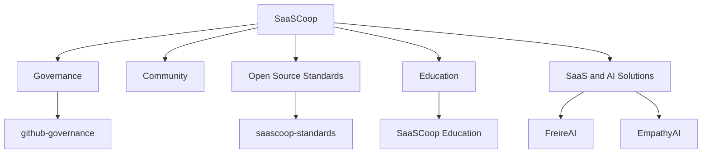

# SaaSCoop Ecosystem

```mermaid
flowchart TD
    A[SaaSCoop] --> B[Governance]
    A --> C[Community]
    A --> D[Open Source Standards]
    A --> E[Education]
    A --> F[SaaS and AI Solutions]

    B --> B1[github-governance]
    D --> D1[saascoop-standards]
    E --> E1[SaaSCoop Education]
    F --> F1[FreireAI]
    F --> F2[EmpathyAI]
```

## Layers

- Governance
- Community
- Technical standards
- Education
- Open source projects
- Community funding
