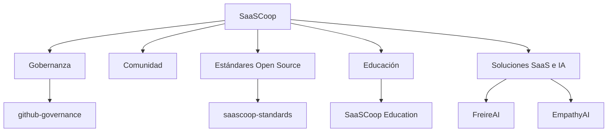

# Ecosistema SaaSCoop

```mermaid
flowchart TD
    A[SaaSCoop] --> B[Gobernanza]
    A --> C[Comunidad]
    A --> D[Estándares Open Source]
    A --> E[Educación]
    A --> F[Soluciones SaaS e IA]

    B --> B1[github-governance]
    D --> D1[saascoop-standards]
    E --> E1[SaaSCoop Education]
    F --> F1[FreireAI]
    F --> F2[EmpathyAI]
```

## Capas

- Gobernanza
- Comunidad
- Estándares técnicos
- Educación
- Proyectos open source
- Financiación comunitaria
