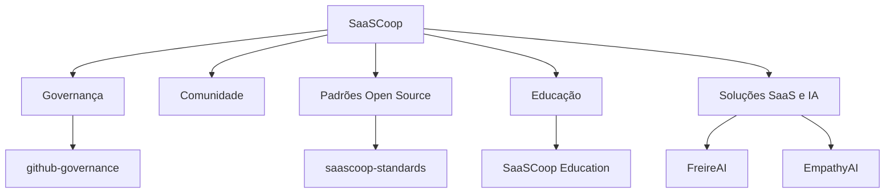

# Ecossistema SaaSCoop

```mermaid
flowchart TD
    A[SaaSCoop] --> B[Governança]
    A --> C[Comunidade]
    A --> D[Padrões Open Source]
    A --> E[Educação]
    A --> F[Soluções SaaS e IA]

    B --> B1[github-governance]
    D --> D1[saascoop-standards]
    E --> E1[SaaSCoop Education]
    F --> F1[FreireAI]
    F --> F2[EmpathyAI]
```

## Camadas

- Governança
- Comunidade
- Padrões técnicos
- Educação
- Projetos open source
- Financiamento comunitário
